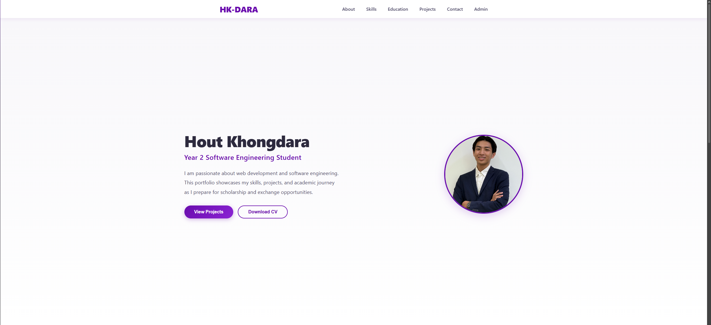
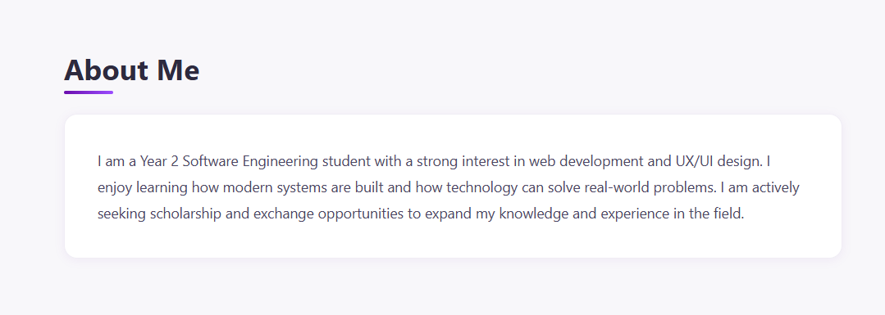
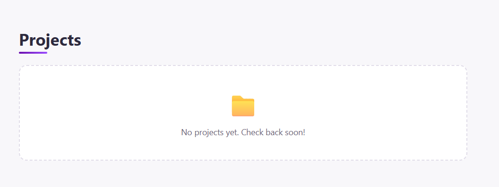

# Software Engineering Portfolio Website

## Project Overview

This project is a full-stack portfolio website developed as the final assessment for the Web Development course. The website showcases my technical skills, academic background, software development projects, and professional interests as a Year 2 Software Engineering student.

The portfolio is designed for scholarship and exchange opportunity applications, allowing visitors to learn more about my experience, projects, and technical abilities while providing a way to contact me directly.

---

## Main Features

- Responsive React user interface
- Professional landing page
- About Me section
- Technical Skills section
- Education and Experience section
- Projects retrieved from MongoDB using a RESTful API ( no project as of now)
- Contact form connected to the backend
- MongoDB database integration
- Complete CRUD operations for project management
- Responsive design for desktop, tablet, and mobile devices

---

## Technologies Used

### Frontend
- React
- HTML5
- CSS3
- JavaScript (ES6+)
- React Router
- Fetch API

### Backend
- Node.js
- Express.js
- RESTful API

### Database
- MongoDB Atlas
- Mongoose

### Tools
- Git
- GitHub
- Visual Studio Code
- AWS

---

## Installation Instructions

### Clone the repository

```bash
git clone https://github.com/YOUR_USERNAME/YOUR_REPOSITORY.git
```

Navigate into the project folder.

---

## Environment Variables

Create a `.env` file inside the `server` folder.


## Running the Frontend

Navigate to the client folder.

```bash
cd client
```

Install dependencies.

```bash
npm install
```

Start the React application.

```bash
npm run dev
```

---

## Running the Backend

Navigate to the server folder.

```bash
cd server
```

Install dependencies.

```bash
npm install
```

Start the backend server.

```bash
npm run dev
```

---


## Screenshots

### Home Page



### About Me



### Projects



### Contact


---

## Live Website

https://main.dxtfucnkdzp54.amplifyapp.com

---

## GitHub Repository

https://github.com/khdara0006/portfolioprojectfinal

---

## Known Limitations

- have no idea what am doing is even right 


---

## Future Improvements

- User authentication and authorization
- Admin dashboard for portfolio management
- Image upload functionality using cloud storage
- Dark and light theme switch
- Project search and filtering
- Blog section
- Downloadable résumé
- Email notifications for contact messages
- there is much stuff that are wrong and need improvement but for now i hope to improve this further more 


## Author

**Hout Khongdara**

Year 2 Software Engineering Student

Email: darahout2406@example.com

GitHub: https://github.com/khdara0006

LinkedIn: havent made one yet 